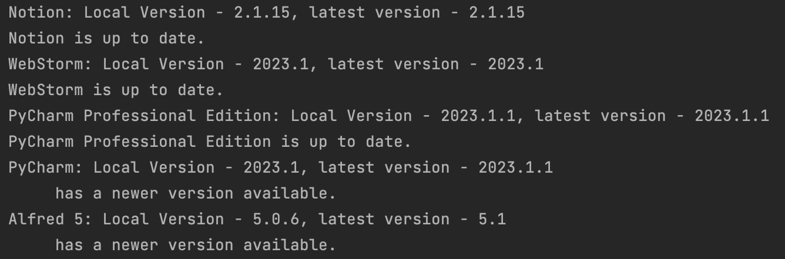

# MacAppScan
MacAppScan is a Python program that scans all the applications installed on your local machine and compares
their versions to the latest version numbers available online. It helps you keep your applications up to date by 
providing information on the latest versions and allowing you to easily update them.

The program fetches the latest version numbers from the [MacUpdate](https://www.macupdate.com) website, which is a reliable source for software 
updates on macOS. The comparison results are displayed in the console/terminal, allowing you to quickly identify which 
applications have updates available.




## Requirements
- Python 3.x
- requirements.txt (the repository contains it)

## Installation
- Clone the repository to your local machine:
```sh
git clone https://github.com/timoterik/mac-app-scan.git
```
- Install the required packages: 
```sh
pip install -r /requirements.txt
```
- Run the main.py file to start the virtual assistant:
```sh
python /main.py
```

## Notes

Make sure you have an active internet connection for the program to fetch the latest version numbers from MacUpdate.
The program relies on the accuracy and availability of version information provided by the MacUpdate website. 
In some cases, the website may not have the latest version information for certain applications.
